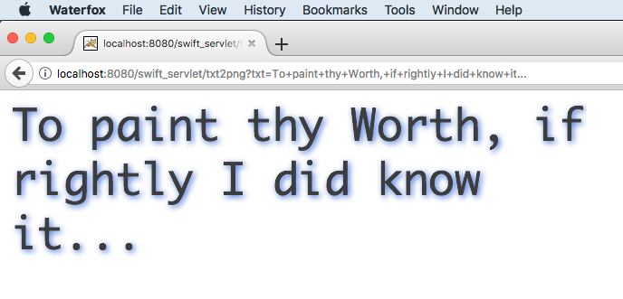

# Swift Servlet
### Example of Swift <-> Java/Tomcat integration with JNI   -- coded by LuigiG

This project is an example of Swift/Java integration in the form of a Web Servlet fully backed by a native library written in Swift. It is mainly a learning experiment for the purpose of gaining some exposure to both Swift and JNI (Java Native Interface). Not meant to be particularly useful, if only for the security implications, though perhaps it could be interesting to developers of desktop apps that wish the expose a localhost-bound browser interface.

    
	Tested with:
	
	Swift 4.2 - swiftc Apple Swift version 4.2.1 (swiftlang-1000.11.42 clang-1000.11.45.1)
	
	Java 10 - javac 10.0.2
	
	Apache Tomcat 8.5.16

### Building
##### Compiling and installing the native library
The native library is written in Swift, with a small helper module written in C (though even that part could, with some work, be implemented in Swift itself). To compile:

     # Make sure the command line tools for Swift 4.2 and Clang/LLVM 10.x are installed 
     cd swift
	 
     # ...review settings in Makefile
	 # Build
     make lib
	 
	 # Copy the jnilib (actually a dylib) to the target dir
     make install
   
##### Compiling  the and deploying the web application
The Java web application is, essentially, empty with the exception of a facade servlet that does nothing but refer to the native library. It can be built and deployed with Apache Ant:   

     # Make sure the Java JDK and Apache Ant are installed
     # Make sure Apache Tomcat 8.5+ or equivalent are installed
     cd webapp
	 
     # ...review settings in build.xml
	 # Build
     ant clean dist
	 
	 # To deploy the war file
	 ant deploy.LOCAL 
	 
	 # To restart the container and reflect changes to the jnilib
     ant bounce.LOCAL 

### Running

* The web application URL is http://localhost[:port]/swift_servlet/
* The web servlet URL is http://localhost[:port]/swift_servlet/txt2png

The servlet implements the methods GET and HEAD

      GET http://localhost[:port]/swift_servlet/txt2png?txt=Input+Text
	  Returns an HTML page with the PNG representation of the "txt" parameter's contents

      HEAD http://localhost[:port]/swift_servlet/txt2png?txt=Input+Text
	  The same HTTP headers as GET but with an empty response body

##### Example #1
     $ curl --head  "http://localhost:8080/swift_servlet/txt2png?txt=WellOK"	  
	 HTTP/1.1 200
	 txt2png-input: WellOK
	 Transfer-Encoding: chunked
	 Date: Fri, 25 Jan 2019 09:21:55 GMT	  

##### Example #2

Point browser to [http://localhost:8080/swift_servlet/txt2png?txt=To+paint+thy+Worth,+if+rightly+I+did+know+it%2E%2E%2E]()

### Notes

As a minimal security constraint, the web servlet naively attempts to ignore requests not coming from the localhost. If you wish to turn off this restriction, the below function can be removed or changed to return true in all cases. A more flexible and secure level of control can be achieved by creating a context.xml file with a custom  [valve configuration](https://tomcat.apache.org/tomcat-8.5-doc/config/valve.html#Remote_Address_Filter).

     private func isLocal(
      _ ip:String
     ) -> Bool {
      return (ip == "127.0.0.1" || ip == "0:0:0:0:0:0:0:1" || ip == "::1")
     }

### License
Apache License Version 2.0 http://www.apache.org/licenses/LICENSE-2.0

### Contributing

Please feel free to contribute bugfixes/enhancements via github.

### Feedback
Thanks for visting.
 
LuigiG@4e71.org     
